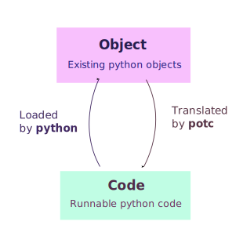

# DI-treetensor

[](https://pypi.org/project/DI-treetensor/)


[](https://github.com/opendilab/DI-treetensor/actions?query=workflow%3A%22Docs+Deploy%22)
[](https://github.com/opendilab/DI-treetensor/actions?query=workflow%3A%22Code+Test%22)
[](https://github.com/opendilab/DI-treetensor/actions?query=workflow%3A%22Badge+Creation%22)
[](https://github.com/opendilab/DI-treetensor/actions?query=workflow%3A%22Package+Release%22)
[](https://codecov.io/gh/opendilab/DI-treetensor)

[](https://github.com/opendilab/DI-treetensor/stargazers)
[](https://github.com/opendilab/DI-treetensor/network)

[](https://github.com/opendilab/DI-treetensor/issues)
[](https://github.com/opendilab/DI-treetensor/pulls)
[](https://github.com/opendilab/DI-treetensor/graphs/contributors)
[](https://github.com/opendilab/DI-treetensor/blob/master/LICENSE)

`treetensor` is a generalized tree-based tensor structure mainly developed by [OpenDILab Contributors](https://github.com/opendilab).

Almost all the operation can be supported in form of trees in a convenient way to simplify the structure processing when the calculation is tree-based.

## Installation

You can simply install it with `pip` command line from the official PyPI site.

```shell
pip install di-treetensor
```

For more information about installation, you can refer to [Installation](https://opendilab.github.io/DI-treetensor/main/tutorials/installation/index.html#).

## Documentation

The detailed documentation are hosted on [https://opendilab.github.io/DI-treetensor](https://opendilab.github.io/DI-treetensor/).

Only english version is provided now, the chinese documentation is still under development.

## Quick Start

You can easily create a tree value object based on `FastTreeValue`.

```python
import builtins
import os
from functools import partial

import treetensor.torch as torch

print = partial(builtins.print, sep=os.linesep)

if __name__ == '__main__':
    # create a tree tensor
    t = torch.randn({'a': (2, 3), 'b': {'x': (3, 4)}})
    print(t)
    print(torch.randn(4, 5))  # create a normal tensor
    print()

    # structure of tree
    print('Structure of tree')
    print('t.a:', t.a)  # t.a is a native tensor
    print('t.b:', t.b)  # t.b is a tree tensor
    print('t.b.x', t.b.x)  # t.b.x is a native tensor
    print()

    # math calculations
    print('Math calculation')
    print('t ** 2:', t ** 2)
    print('torch.sin(t).cos()', torch.sin(t).cos())
    print()

    # backward calculation
    print('Backward calculation')
    t.requires_grad_(True)
    t.std().arctan().backward()
    print('grad of t:', t.grad)
    print()

    # native operation
    # all the ops can be used as the original usage of `torch`
    print('Native operation')
    print('torch.sin(t.a)', torch.sin(t.a))  # sin of native tensor

```

The result should be

```text
<Tensor 0x7f0dae602760>
├── a --> tensor([[-1.2672, -1.5817, -0.3141],
│                 [ 1.8107, -0.1023,  0.0940]])
└── b --> <Tensor 0x7f0dae602820>
    └── x --> tensor([[ 1.2224, -0.3445, -0.9980, -0.4085],
                      [ 1.5956,  0.8825, -0.5702, -0.2247],
                      [ 0.9235,  0.4538,  0.8775, -0.2642]])

tensor([[-0.9559,  0.7684,  0.2682, -0.6419,  0.8637],
        [ 0.9526,  0.2927, -0.0591,  1.2804, -0.2455],
        [ 0.4699, -0.9998,  0.6324, -0.6885,  1.1488],
        [ 0.8920,  0.4401, -0.7785,  0.5931,  0.0435]])

Structure of tree
t.a:
tensor([[-1.2672, -1.5817, -0.3141],
        [ 1.8107, -0.1023,  0.0940]])
t.b:
<Tensor 0x7f0dae602820>
└── x --> tensor([[ 1.2224, -0.3445, -0.9980, -0.4085],
                  [ 1.5956,  0.8825, -0.5702, -0.2247],
                  [ 0.9235,  0.4538,  0.8775, -0.2642]])

t.b.x
tensor([[ 1.2224, -0.3445, -0.9980, -0.4085],
        [ 1.5956,  0.8825, -0.5702, -0.2247],
        [ 0.9235,  0.4538,  0.8775, -0.2642]])

Math calculation
t ** 2:
<Tensor 0x7f0dae602eb0>
├── a --> tensor([[1.6057, 2.5018, 0.0986],
│                 [3.2786, 0.0105, 0.0088]])
└── b --> <Tensor 0x7f0dae60c040>
    └── x --> tensor([[1.4943, 0.1187, 0.9960, 0.1669],
                      [2.5458, 0.7789, 0.3252, 0.0505],
                      [0.8528, 0.2059, 0.7699, 0.0698]])

torch.sin(t).cos()
<Tensor 0x7f0dae621910>
├── a --> tensor([[0.5782, 0.5404, 0.9527],
│                 [0.5642, 0.9948, 0.9956]])
└── b --> <Tensor 0x7f0dae6216a0>
    └── x --> tensor([[0.5898, 0.9435, 0.6672, 0.9221],
                      [0.5406, 0.7163, 0.8578, 0.9753],
                      [0.6983, 0.9054, 0.7185, 0.9661]])


Backward calculation
grad of t:
<Tensor 0x7f0dae60c400>
├── a --> tensor([[-0.0435, -0.0535, -0.0131],
│                 [ 0.0545, -0.0064, -0.0002]])
└── b --> <Tensor 0x7f0dae60cbe0>
    └── x --> tensor([[ 0.0357, -0.0141, -0.0349, -0.0162],
                      [ 0.0476,  0.0249, -0.0213, -0.0103],
                      [ 0.0262,  0.0113,  0.0248, -0.0116]])


Native operation
torch.sin(t.a)
tensor([[-0.9543, -0.9999, -0.3089],
        [ 0.9714, -0.1021,  0.0939]], grad_fn=<SinBackward>)

```

For more quick start explanation and further usage, take a look at:

* [Quick Start](https://opendilab.github.io/DI-treetensor/main/tutorials/quick_start/index.html)

## Extension

If you need to translate `treevalue` object to runnable source code, you may use the [potc-treevalue](https://github.com/potc-dev/potc-treevalue) plugin with the installation command below

```
pip install DI-treetensor[potc]
```

In potc, you can translate the objects to runnable python source code, which can be loaded to objects afterwards by the python interpreter, like the following graph



For more information, you can refer to

- [potc-dev/potc](https://github.com/potc-dev/potc)
- [potc-dev/potc-treevalue](https://github.com/potc-dev/potc-treevalue)
- [potc-dev/potc-torch](https://github.com/potc-dev/potc-torch)
- [Potc Plugin Installation](https://opendilab.github.io/DI-treetensor/main/tutorials/plugins/index.html#potc-support)

## Contribution

We appreciate all contributions to improve DI-treetensor, both logic and system designs. Please refer to CONTRIBUTING.md for more guides.

And users can join our [slack communication channel](https://join.slack.com/t/opendilab/shared_invite/zt-v9tmv4fp-nUBAQEH1_Kuyu_q4plBssQ), or contact the core developer [HansBug](https://github.com/HansBug) for more detailed discussion.

## License

`DI-treetensor` released under the Apache 2.0 license.
